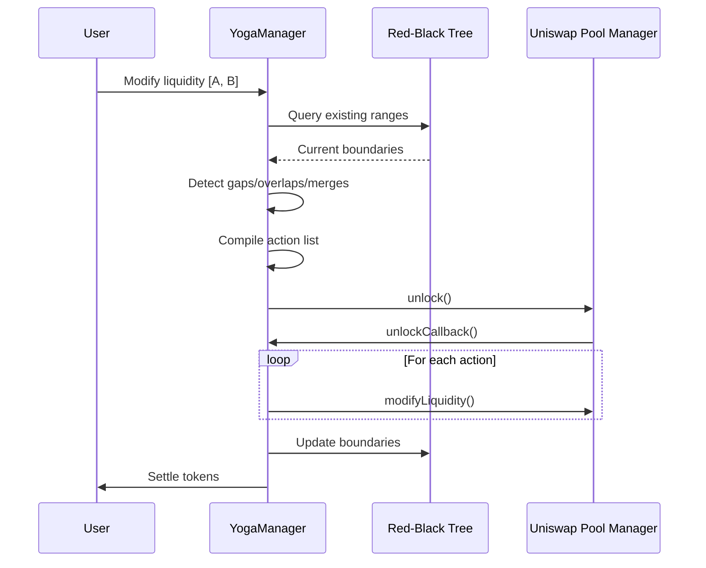

# Yoga Position Manager

# The Core Problem

In Uniswap V4, the default position manager rigidly defines a "position" by its tick boundaries. This creates friction when you want to:

1. **Rebalance** liquidity to a different price range without burning/minting new tokens
2. **Split** a range (e.g., remove liquidity from the middle of a wide position)
3. **Merge** adjacent ranges to consolidate fragmented positions

# Solution

A declarative position manager that stores multiple conventional liquidity ranges within a single NFT position. Users manage fragmented, non-contiguous, or overlapping liquidity ranges through one NFT interface, eliminating the overhead of managing complex strategies across multiple positions.

# How It Works

The contract logic:

1. **Tree Lookup**: Check the NFT's Red-Black Tree for existing ranges
2. **Gap Detection**: If [A, B] is disconnected, mark as new insert
3. **Overlap Detection**: If [A, B] intersects existing ranges, calculate splits
4. **Merge Check**: If new liquidity matches a neighbor's level, fuse them
5. **Action Compilation**: Build list of raw Uniswap operations
6. **Execution**: Unlock pool, execute actions via callback, update tree, settle tokens

# Use Cases

By abstracting positions into trees of ranges, Yoga enables:

- **Dynamic Rebalancing**: Shift liquidity without minting new positions
- **Range Orders**: Efficiently manage single-sided positions across price levels
- **Advanced Strategies**: Build sophisticated protocols (e.g., LVR mitigation hooks) requiring granular liquidity management without NFT overhead
# Future work

* MultiCall mode to create arbitrary liquidity distributions in a single transaction
* Flag to settle in ERC6909 or ERC20 tokens
* ERC721 enumerability
* Support for hooks that require hookData
* Clean up `_populateActions`
* Stateful invariant testing
* `burn` (with pagination for gas limits)
* Fancy `tokenURI` images
* Permit2 support
* Easy function for collecting/compounding swap fees
* Allow creation of non-adjacent liquidity ranges
* Pool initialization on `mint`
